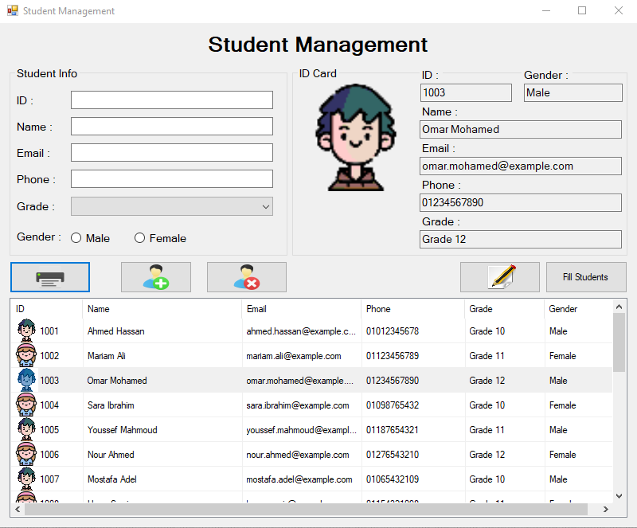
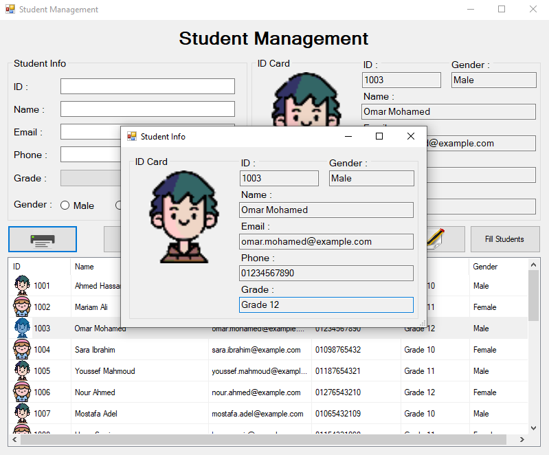
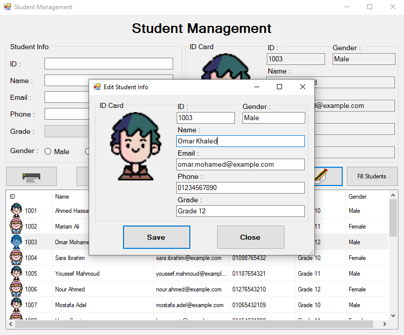

# Student Management System

A desktop application built with **C# (.NET / Windows Forms)** for managing student records cleanly and efficiently. The application allows users to perform core CRUD operations, view detailed student ID cards, edit information via modal dialogs, and quickly populate mock data for testing.

---

## Features

- **➕ Add Student**: Easily register a new student with their ID, Full Name, Email, Phone, Grade, and Gender.
- **❌ Delete Student**: Remove selected student records from the system.
- **✏️ Edit Student Info**: Open a dedicated modal form (`Edit Student Info`) to update existing student details smoothly.
- **🖨️ Print / Preview ID Card**: Displays a dedicated popup window (`Student Info`) showing the selected student's ID Card and full profile, designed as a template ready for future physical printing integration.
- **🎲 Fill Students (Mock Data)**: Populate the list instantly with dummy student data for fast testing and demonstration.
- **📋 Interactive Data Table**: Dynamic DataGridView displaying student avatars, personal info, and academic grades.

---

## Screenshots

| Main Dashboard | Print Preview (`Student Info`) | Edit Student (`Edit Student Info`) |
| :---: | :---: | :---: |
|  |  |  |

---

## Built With

- **Language**: C#
- **Framework**: .NET / Windows Forms (WinForms)
- **UI Components**: DataGridView, Custom Dialogs, GDI+ / Image Handling

---

## Getting Started

### Prerequisites

- [Visual Studio 2019 / 2026](https://visualstudio.microsoft.com/) or higher
- .NET Desktop Development Workload installed

### Installation & Running

1. **Clone the repository:**
   ```bash
   git clone [https://github.com/your-username/StudentManagement.git](https://github.com/your-username/StudentManagement.git)

2. **Open the solution:**
* Double-click `StudentManagement.sln` to open it in Visual Studio.

3. **Build and Run:**
* Press `F5` or click **Start** to run the project.

---

## Future Enhancements

- [ ] Integrate actual physical printing logic using `PrintDocument`.
- [ ] Connect with a local database (SQL Server / SQLite) for persistent data storage.
- [ ] Add search and filter options by Student ID or Name.

---

## License

This project is open-source and available under the [MIT License](LICENSE).